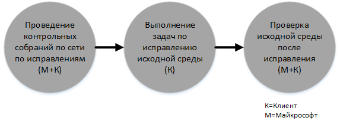
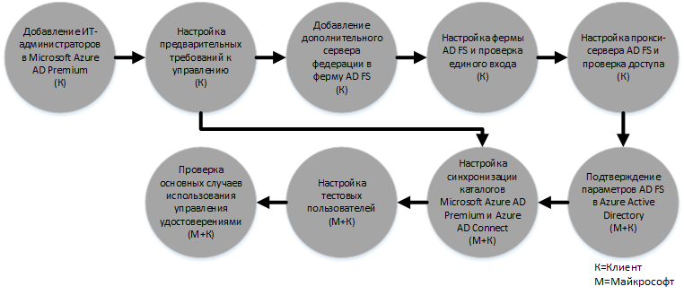

# Процесс получения преимущества FastTrack Center для Azure Active Directory Premium 
Если ваша организация имеет право на преимущество "Центр FastTrack" для Microsoft Azure AD Premium, вы можете привлечь удаленных специалистов корпорации Майкрософт для подготовки вашей среды Microsoft Azure AD Premium к работе. Чтобы узнать, обладает ли ваша организация соответствующими правами, см. статью [Преимущество FastTrack Center для Azure Active Directory Premium](../Topic/FastTrack_Center_Benefit_for_Azure_Active_Directory_Premium.md).

Эта статья содержит следующие сведения:

-   [Overview of the onboarding process](#overview)

-   [Expectations for your source environment](#expectations_src_environ)

-   [Phases of the onboarding process](#phases_onboarding_process)

-   [Microsoft responsibilities](#microsoft_responsibilities) для каждого этапа

-   [Your responsibilities](#your_responsibilities) для каждого этапа

Адаптация дает следующие результаты:

-   Создается клиент Microsoft Azure AD Premium.

-   Лицензированные пользователи могут получить доступ к возможностям Microsoft Azure AD Premium с помощью одного из следующих вариантов удостоверений.

    -   Облачные удостоверения (уникальные учетные записи Microsoft Azure AD Premium).

    -   Синхронизированные удостоверения: учетные записи Microsoft Azure AD, синхронизированные из локальной службы Active Directory с помощью средства Azure Active Directory Connect (Azure AD Connect) для клиентов с одним или несколькими лесами Active Directory.

    -   Федеративные удостоверения — с учетными записями Microsoft Azure AD Premium, которые были:

        -   синхронизированы из службы Active Directory с помощью средства Azure Active Directory Connect для клиентов с одним лесом Active Directory;

        -   сделаны федеративными со службами федерации Active Directory (AD FS) 2.0 или более поздней версии из локальной службы Active Directory.

## Обзор процесса адаптации
Адаптация состоит из двух основных компонентов:

-   **Основные возможности** — задачи, необходимые для настройки конфигурации клиента и интеграции с Azure AD, если это необходимо. Основные возможности также представляют собой основу, на базе которой выполняется адаптация других соответствующих служб Microsoft Online.

-   **Адаптация служб** — задачи, необходимые для настройки Microsoft Azure AD Premium в автономном режиме или с синхронизацией каталогов Azure AD Connect или службами федерации AD.

На следующей схеме представлен процесс использования преимущества "Центр FastTrack" с точки зрения временных периодов.

Базовый процесс выглядит следующим образом:

-   Майкрософт свяжется с вами в течение 30 дней после приобретения соответствующего плана. Можно также запросить помощь на сайте [FastTrack Center](http://fasttrack.microsoft.com/), если вы готовы к развертыванию этих служб для вашей организации. Чтобы запросить помощь, войдите на сайт FastTrack Center (http://fasttrack.microsoft.com), перейдите на панель мониторинга, выберите имя компании, откройте вкладку "Предложения" и нажмите кнопку "Запросить помощь" для соответствующей службы. После начала поддержки адаптации мы составим расписание для проведения собраний по сети.

-   Команда Майкрософт поможет вам с основными возможностями, а затем окажет однократную помощью с адаптацией каждой соответствующей службы.

Вся поддержка по адаптации будет предоставляться удаленно назначенными специалистами корпорации Майкрософт:

-   Корпорация Майкрософт поможет вам с проведением различных работ по адаптации, предоставляя средства, документацию и рекомендации. Если вы хотите, чтобы специалисты корпорации Майкрософт выполнили определенные задачи по настройке, вы можете предоставить Майкрософт соответствующие права доступа и разрешения для выполнения этих задач.

-   Поддержка адаптации обеспечивается центром FastTrack и доступна в обычное рабочее время для данной области.

-   Поддержка адаптации доступна на традиционном китайском, английском, французском, немецком, итальянском, японском, португальском (Бразилия) или испанском языке.

-   Команда FastTrack может работать непосредственно с вами либо с вашим представителем.

## Ожиданий для исходной среды
Возможно, в вашей среде уже есть локальная служба Microsoft Active Directory, которую вы хотите интегрировать с Microsoft Azure AD Premium для удобного управления удостоверениями из одной консоли. Преимущество "Центр FastTrack" включает помощь в интеграции Microsoft Azure AD Premium с существующей локальной реализацией. Если необходима интеграция, ваша исходная среда должна иметь определенный минимальный уровень для такого применения.

В следующей таблице показаны ожидания для исходной среды при адаптации.

|Действие|Ожидание для исходной среды|
|------------|-------------------------------|
|Основные возможности|Леса Active Directory, для которых в качестве функционального уровня леса установлен Windows Server 2008 или более поздней версии, со следующей конфигурацией:  -   Один лес Active Directory -   Несколько лесов Active Directory **Note:** Для всех конфигураций с несколькими лесами развертывание служб федерации Active Directory не входит в преимущество "Центр FastTrack".|
|Адаптация служб  -   Microsoft Azure AD Premium|Локальная служба Active Directory и среда были подготовлены для Azure AD Premium, что включает исправление выявленных проблем, которые могли бы помешать интеграции с Azure AD и компонентами Azure AD Premium.|

## Этапы процесса адаптации
Адаптация Microsoft Azure AD Premium включает пять основных этапов, как показано на следующем рисунке.

-   Инициировать

-   Оценка

-   Исправление

-   Разрешить

-   Закрыть

Подробное описание задач для каждого этапа см. в разделах [Microsoft responsibilities](#microsoft_responsibilities) и [Your responsibilities](#your_responsibilities).

### Начальный этап
После приобретения соответствующего числа лицензий следуйте указаниям из сообщения электронной почты с подтверждением покупки, чтобы связать эти лицензии с существующим или новым клиентом. Корпорация Майкрософт проверит наличие у вас прав на использование преимущества "Центр FastTrack". Майкрософт свяжется с вами в течение 30 дней после приобретения соответствующего плана. Можно также запросить помощь на сайте [FastTrack Center](http://fasttrack.microsoft.com/), если вы готовы к развертыванию этих служб для вашей организации. Чтобы запросить помощь, войдите на сайт FastTrack Center (http://fasttrack.microsoft.com), перейдите на панель мониторинга, выберите имя компании, откройте вкладку "Предложения" и нажмите кнопку "Запросить помощь" для соответствующей службы. После начала поддержки адаптации мы составим расписание для проведения собраний по сети.

На этом этапе мы обсудим весь процесс адаптации, проведем проверку данных и назначим организационную встречу.

### Этап оценки
После начала процесса адаптации корпорация Майкрософт будет сотрудничать с вами для проведения оценки исходной среды и требований. Для оценки вашей среды будут применяться специальные средства, и корпорация Майкрософт даст вам рекомендации по оценке локальной службы Active Directory, веб-браузеров, операционных систем клиентских устройств, службы DNS, сети, инфраструктуры и системы удостоверений. Эти рекомендации позволят определить потребность в каких-либо изменениях перед адаптацией. На основе текущего состояния мы предоставим план исправления исходной среды, позволяющий обеспечить выполнение минимальных требований для успешной адаптации Microsoft Azure AD Premium. Мы также настроить установим определенные контрольные точки на этапе исправления.

### Этап исправления
При необходимости вы выполните задачи из плана исправления для своей исходной среды, чтобы она удовлетворяла требованиям по адаптации каждой службы.

Перед началом этапа реализации мы совместно проверьте результаты исправлений, чтобы убедиться, что все готово к дальнейшей работе.

### Этап реализации
После выполнения всех исправлений начинается настройка базовой инфраструктуры для использования служб и для подготовки Microsoft Azure AD Premium.

**Этап реализации: основные возможности**

Реализация основных возможностей включает в себя подготовку служб и интеграцию клиента и удостоверений. Она также включает меры по формированию платформы для адаптации Microsoft Azure AD Premium.

После завершения базовой адаптации можно приступать к адаптации Microsoft Azure AD Premium.

**Этап реализации процесса адаптации Microsoft Azure AD Premium**

При необходимости можно настроить в среде Microsoft Azure AD Premium синхронизацию каталогов с помощью Azure AD Connect и службы федерации Active Directory (AD FS).

В случае сценариев Microsoft Azure AD Premium, включающих синхронизацию локальных удостоверений с облаком, мы поможем вам, добавив ИТ-администраторов и пользователей в вашу подписку, настроив необходимые компоненты управления, Microsoft Azure AD Premium, синхронизацию каталогов и служб федерации Active Directory с помощью Azure AD Connect, тестовых пользователей и проверив основные варианты использования для службы.

Программа установки Microsoft Azure AD Premium подразумевает включение следующих возможностей.

-   Самостоятельный сброс пароля (SSPR)

-   Azure Multi-Factor Authentication (MFA)

-   Приложение SaaS (программное обеспечение как услуга) — настройка одного приложения SaaS

-   Управление группами самообслуживания (SSGM)

-   Отчеты по администрированию

## Обязанности корпорации Майкрософт

### Общие

-   Предоставлять вам удаленную поддержку в выполнении необходимых действий по настройке в соответствии с подробным описанием этапов.

-   Предоставлять доступные средства, документацию и программное обеспечение, консоли администрирования и скрипты, помогающие упростить или исключить задачи по настройке.

Предоставление доступа и разрешений корпорации Майкрософт не обязательно для того, чтобы использовать преимущество "Центр FastTrack". В некоторых случаях можно предоставить корпорации Майкрософт соответствующие права доступа и разрешения для выполнения определенных действий от вашего имени.

### Начальный этап

-   Связаться с вами в течение 30 дней после приобретения соответствующих лицензий для нового клиента.

-   Сотрудничать с вами для начала процесса адаптации в течение 90 дней с покупки соответствующих лицензий.

-   Определить, какие соответствующие службы вы хотите освоить.

### Этап оценки

-   Предоставить административную сводку.

-   Предоставить рекомендации по следующим аспектам.

    -   Потребности для DNS, сети и инфраструктуры.

    -   Потребности клиента (веб-браузер, клиентская операционная система и потребности служб).

    -   Удостоверение пользователя и подготовка к работе.

    -   Идентификация требований к синхронизации каталогов.

    -   Определение того, соответствует ли синхронизация хэшей паролей задачам клиента и необходимо ли использование служб федерации Active Directory.

    -   Включение соответствующих служб, которые были приобретены и определены как часть адаптации.

    -   Определение необходимых требований для пилотной и тестовой среды, например тестовые учетные записи, тестовый экземпляр приложения SaaS (например, SalesForce).

-   Составить график для исправлений.

-   Предоставить контрольный список коррекции.

### Этап исправления

-   Провести конференцию с вами по согласованному расписанию, чтобы проанализировать ход выполнения операций исправления.

-   Оказать помощь с запуском средств для определения и устранения проблем и с обработкой результатов.

### Этап реализации
Предоставить рекомендации по следующим аспектам:

-   Активация клиента Microsoft Azure AD Premium.

-   Настройка портов брандмауэра.

-   Настройка DNS для соответствующих служб.

-   Проверка подключения к службам Microsoft Azure AD Premium.

-   Для среды с одним лесом:

    -   Настройка синхронизации каталогов между доменными службами служб Active Directory (AD DS) и Azure AD Connect, если это необходимо.

    -   Настройка синхронизации паролей с помощью средства Azure AD Connect.

-   Для среды с несколькими лесами

    -   Настройка синхронизации Azure AD Connect, настройка синхронизации для сценариев с несколькими лесами. Обратите внимание, что синхронизация хэшей паролей и обратная запись паролей поддерживают несколько лесов.  Однако другие сценарии обратной записи не поддерживаются.

    -   Настройка синхронизации между локальными лесами Active Directory и каталогом Microsoft Azure AD Premium (Azure Active Directory).

        > [!NOTE]
        > Разработка и внедрение расширений настраиваемых правил находятся вне области действия.

-   Для одного леса, если цель — федеративные удостоверения: установка и настройка служб федерации Active Directory (AD FS) для использования проверки подлинности локального домена совместно с Microsoft Azure AD Premium в отказоустойчивой конфигурации с одним сайтом (при необходимости).

    > [!NOTE]
    > Для всех конфигураций с несколькими лесами развертывание служб федерации Active Directory не входит в область действия преимущества адаптации.

-   Проверка функциональности единого входа (SSO), если она развернута.

#### Этап реализации — Azure AD Premium — с Azure AD Connect и AD FS
Предоставить рекомендации по следующим аспектам.

-   Подготовка пользователей, включая лицензирование.

-   Синхронизация каталога Azure AD Connect (с обратной записью паролей и синхронизацией хэшей паролей).

-   Службы федерации Active Directory (AD FS)

-   Самостоятельный сброс пароля (SSPR)

-   Azure Multi-Factor Authentication (MFA).

-   Одно интегрированное приложение, включая единый вход для приложений SaaS.

-   Отчеты об использовании и отчеты безопасности для администраторов.

-   Управление группами самообслуживания (SSGM).

-   Прокси приложений.

-   Уведомления администратора.

-   Настраиваемый экран входа в систему, включая логотип, текст и изображения.

## Ваши обязанности
В этом разделе описываются некоторые ваши обязанности относительно процесса адаптации.

### Общие

-   Любые улучшения и интеграции для вашего клиента Microsoft Azure AD Premium, выходящие за рамки описанных в этой статье вариантов настройки.

-   Общее управление программой и проектом по использованию ресурсов.

-   Взаимодействие с конечными пользователями, ведение необходимо им документации, их обучение и управление изменениями.

-   Ведение документации для службы технической поддержки и обучение ее сотрудников.

-   Создание отчетов, презентаций или протоколов собраний, относящихся к вашей организации.

-   Создание документации по архитектуре и технической документации для вашей организации.

-   Проектирование, приобретение, установка и настройка оборудования и сетевых компонентов.

-   Приобретение, установка и настройка программного обеспечения.

-   Контроль, настройка и применение политик безопасности, помимо тех, которые созданы для тестирования базовой конфигурации и функциональных возможностей служб Microsoft Azure AD Premium.

-   Регистрация учетных записей, помимо тех, которые используются для проверки базовой конфигурации и функциональных возможностей служб Microsoft Azure AD Premium.

-   Настройка конфигурации, анализ, проверка пропускной способности, тестирование и мониторинг сети.

-   Управление процессом утверждения для управления техническими изменениями и создание вспомогательной документации.

-   Изменение рабочей модели и руководств по эксплуатации.

-   Настройка локальной многофакторной проверки подлинности.

-   Списание и удаление исходных сред и служб, ранее используемых клиентом.

-   Создание и обслуживание тестовой среды.

-   Установка пакетов обновления и других необходимых обновлений на серверах инфраструктуры.

-   Предоставление и настройка любых общедоступных SSL-сертификатов.

-   Составление заявления об условиях использования, которое следует скорректировать и отобразить на экранах устройств, доступных конечным пользователям.

### Начальный этап

-   Работа с рабочей группой Майкрософт для начала адаптации соответствующих служб.

-   Принять участие в организационной встрече, контролировать и направлять участников со стороны вашей компании, а также подтвердить сроки исправления.

### Этап оценки

-   Определить соответствующих заинтересованных лиц (включая руководителя проекта) для выполнения необходимых действий по оценке.

-   При необходимости предоставить специалистам корпорации Майкрософт общий доступ к экрану, когда требуется получить рекомендации при запуске средств оценки для среды или подписки Microsoft Azure AD Premium.

-   Участвовать в собраниях для составления контрольного списка исправления и разработки всего плана, включая различные аспекты, связанные с инфраструктурой, сетью, администрированием, подготовкой к синхронизации каталогов, сетевой безопасностью и федеративными удостоверениями.

-   Участвовать в собраниях для выработки подхода к подготовке пользователей.

-   Участвовать в собраниях для планирования конфигурации веб-служб.

-   Создать план поддержки для подготовки к переходу.

### Этап исправления

-   Принять необходимые меры для выполнения исправлений, определенных на этапе оценки.

-   Участвовать в собраниях, где рассматриваются контрольные точки.

### Этап реализации

-   При желании предоставьте специалистам корпорации Майкрософт доступ к экрану для получения рекомендаций при внесении изменений в среду или подписку Microsoft Azure AD Premium.

-   Обеспечить должное управление ресурсами.

-   Настраивать сетевые элементы согласно рекомендациям корпорации Майкрософт.

-   Осуществлять подготовку каталогов и настройку синхронизации каталогов согласно рекомендациям корпорации Майкрософт.

-   Настраивать инфраструктуру безопасности (например, порты брандмауэра) согласно рекомендациям корпорации Майкрософт.

-   Внедрить подходящую клиентскую инфраструктуру.

-   Реализовать подход к подготовке пользователей согласно рекомендациям корпорации Майкрософт.

-   Обеспечить наличие различных служб согласно рекомендациям корпорации Майкрософт.

## Хотите узнать больше?
См. [Microsoft Azure Active Directory](http://azure.microsoft.com/en-us/documentation/services/active-directory/) и [Enterprise Mobility Suite](http://www.microsoft.com/en-us/server-cloud/products/enterprise-mobility-suite/default.aspx).

