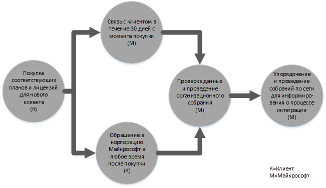
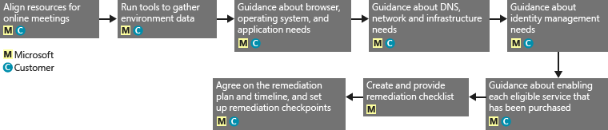
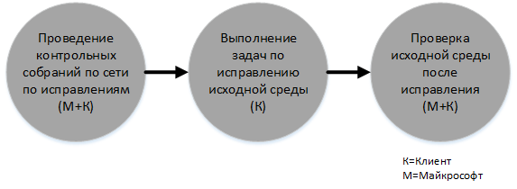
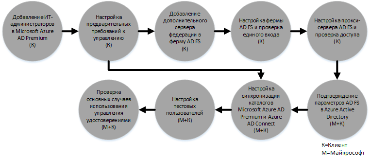

# Процесс преимущества FastTrack Center для Azure Rights Management
Если ваша организация имеет право на преимущество FastTrack Center для Azure Rights Management, вы можете привлечь удаленных специалистов корпорации Майкрософт для подготовки вашей среды Azure RMS к работе. Чтобы узнать, обладает ли ваша организация соответствующими правами, см. статью [Преимущество FastTrack Center для Azure Rights Management](../Topic/FastTrack_Center_Benefit_for_Azure_Rights_Management.md).

Эта статья содержит следующие сведения:

-   [Overview of the onboarding process](#overview_rms)

-   [Expectations for your source environment](#expectations_src_environ_rms)

-   [Phases of the onboarding process](#phases_onboarding_process_rms)

-   [Microsoft responsibilities](#microsoft_responsibilities_rms) для каждого этапа;

-   [Your responsibilities](#your_responsibilities_rms) для каждого этапа.

Адаптация дает следующие результаты:

-   Создается клиент Microsoft Azure RMS.

-   Лицензированные пользователи могут получить доступ к службам Azure RMS с помощью одного из следующих вариантов удостоверений.

    -   Облачные удостоверения (уникальные учетные записи Microsoft Azure AD).

    -   Синхронизированные удостоверения: учетные записи Microsoft Azure AD, синхронизированные из локальной службы Active Directory с помощью средства Azure Active Directory Connect (Azure AD Connect) для клиентов с одним или несколькими лесами Active Directory.

    -   Федеративные удостоверения — с учетными записями Microsoft Azure AD, которые были:

        -   синхронизированы из службы Active Directory с помощью средства Azure Active Directory Connect для клиентов с одним лесом Active Directory;

        -   сделаны федеративными со службами федерации Active Directory (AD FS) 2.0 или более поздней версии из локальной службы Active Directory.

## Обзор процесса адаптации
Адаптация состоит из двух основных компонентов:

-   **Основные возможности** — задачи, необходимые для настройки конфигурации клиента и интеграции с Azure AD, если это необходимо. Базовые возможности также включают базовый уровень для адаптации других соответствующих служб Microsoft Online.

-   **Адаптация служб** — задачи, необходимые для настройки Azure RMS в автономном режиме, — или с синхронизацией каталогов Azure AD Connect, или со службами федерации AD.

Следующая схема описывает временную шкалу для использования преимуществ FastTrack Center.

Базовый процесс выглядит следующим образом:

-   Майкрософт свяжется с вами в течение 30 дней после приобретения соответствующего плана. Можно также запросить помощь на сайте [FastTrack Center](http://fasttrack.microsoft.com/), если вы готовы к развертыванию этих служб для вашей организации. Чтобы запросить помощь, войдите на сайт FastTrack Center (http://fasttrack.microsoft.com), перейдите на панель мониторинга, выберите имя компании, откройте вкладку "Предложения" и нажмите кнопку "Запросить помощь" для соответствующей службы.

-   Команда Майкрософт поможет вам с основными возможностями, а затем окажет однократную помощью с адаптацией каждой соответствующей службы.

Вся поддержка по адаптации будет предоставляться удаленно назначенными специалистами корпорации Майкрософт:

-   Корпорация Майкрософт поможет вам с проведением различных работ по адаптации, предоставляя средства, документацию и рекомендации. Если вы хотите, чтобы специалисты корпорации Майкрософт выполнили определенные задачи по настройке, вы можете предоставить Майкрософт соответствующие права доступа и разрешения для выполнения этих задач.

-   Поддержка адаптации обеспечивается центром FastTrack и доступна в обычное рабочее время для данной области.

-   Поддержка адаптации доступна на традиционном китайском, английском, французском, немецком, итальянском, японском, португальском (Бразилия) или испанском языке.

-   Команда Майкрософт может работать непосредственно с вами либо с назначенным вами представителем.

## Ожиданий для исходной среды
Возможно, в вашей среде уже есть локальная служба Microsoft Active Directory, которую вы хотите интегрировать с Microsoft Azure Active Directory для удобного управления удостоверениями из одной консоли. Преимущество FastTrack Center включает помощь в интеграции Microsoft Azure Active Directory с существующей локальной реализацией. Если необходима интеграция, ваша исходная среда должна иметь определенный минимальный уровень для такого применения.

В следующей таблице показаны ожидания для исходной среды при адаптации.

|Действие|Ожидание для исходной среды|
|------------|-------------------------------|
|Основные возможности|Леса Active Directory, для которых в качестве функционального уровня леса установлен Windows Server 2008 или более поздней версии, со следующей конфигурацией:  -   Один лес Active Directory -   Несколько лесов Active Directory **Note:** Для всех конфигураций с несколькими лесами развертывание служб федерации Active Directory не входит в преимущество FastTrack Center.|
|Адаптация служб  -   Azure RMS|Локальная служба Active Directory и среда были подготовлены для Azure RMS, что включает исправление выявленных проблем, которые могли бы помешать интеграции с Azure AD и компонентами Azure RMS.|

## Этапы процесса адаптации
Адаптация Azure RMS включает пять основных этапов, как показано на следующем рисунке.

-   Инициировать

-   Оценка

-   Исправление

-   Разрешить

-   Закрыть

Подробное описание задач для каждого этапа см. в разделах [Microsoft responsibilities](#microsoft_responsibilities_rms) и [Your responsibilities](#your_responsibilities_rms).

### Начальный этап
После приобретения соответствующего количества лицензий следуйте указаниям из сообщения электронной почты с подтверждением покупки, чтобы связать эти лицензии с существующим или новым клиентом. Корпорация Майкрософт проверит наличие у вас прав на использование преимущества FastTrack Center. Майкрософт свяжется с вами в течение 30 дней после приобретения соответствующего плана. Можно также запросить помощь на сайте [FastTrack Center](http://fasttrack.microsoft.com/), если вы готовы к развертыванию этих служб для вашей организации. Чтобы запросить помощь, войдите на сайт FastTrack Center (http://fasttrack.microsoft.com), перейдите на панель мониторинга, выберите имя компании, откройте вкладку "Предложения" и нажмите кнопку "Запросить помощь" для соответствующей службы.

На этом этапе мы обсудим весь процесс адаптации, проведем проверку данных и назначим организационную встречу.

### Этап оценки
После начала процесса адаптации корпорация Майкрософт будет сотрудничать с вами для проведения оценки исходной среды и требований. Для оценки вашей среды будут применяться специальные средства, и корпорация Майкрософт даст вам рекомендации по оценке локальной службы Active Directory, веб-браузеров, операционных систем клиентских устройств, службы DNS, сети, инфраструктуры и системы удостоверений. Эти рекомендации позволят определить потребность в каких-либо изменениях перед адаптацией. На основе текущего состояния мы представим план исправления, позволяющий обеспечить выполнение минимальных требований для успешного освоения Azure RMS. Мы также настроить установим определенные контрольные точки на этапе исправления.

### Этап исправления
При необходимости вы выполните задачи из плана исправления для своей исходной среды, чтобы она удовлетворяла требованиям по адаптации каждой службы.

Перед началом этапа реализации мы совместно проверьте результаты исправлений, чтобы убедиться, что все готово к дальнейшей работе.

### Этап реализации
После выполнения всех исправлений начинается настройка базовой инфраструктуры для использования службы и подготовка Azure RMS.

**Этап реализации: основные возможности**

Реализация основных возможностей включает в себя подготовку служб и интеграцию клиента и удостоверений. Она также включает меры по формированию платформы для адаптации Microsoft Azure RMS.

После завершения базовой адаптации можно приступать к адаптации для Azure RMS.

**Этап реализации — Azure RMS**

Среду Azure RMS можно настроить с синхронизацией каталогов Azure AD Connect и служб федерации Active Directory Federation Services (AD FS).

Для сценариев Azure RMS, включающих синхронизацию локальных идентификаторов с облаком, мы поможем вам, добавив ИТ-администраторов и пользователей в подписку, настроив необходимые компоненты управления, Azure RMS, синхронизацию каталога с помощью Azure AD Connect и служб федерации Active Directory через Azure AD Connect, настроив тестовых пользователей и проверив ваши основные варианты использования службы.

Установка Azure RMS подразумевает использование следующих компонентов:

-   включение службы RMS;

-   настройку управление правами на доступ к данным для Exchange Online и Sharepoint Online;

-   cоединитель Rights Management для локальных Exchange и SharePoint;

-   приложение для управления доступом RMS для устройств с системами Windows и отличными от Windows.

## Обязанности корпорации Майкрософт

### Общие

-   Предоставлять вам удаленную поддержку в выполнении необходимых действий по настройке в соответствии с подробным описанием этапов.

-   Предоставлять доступные средства, документацию и программное обеспечение, консоли администрирования и скрипты, помогающие упростить или исключить задачи по настройке.

Предоставление доступа и разрешений корпорации Майкрософт не обязательно для того, чтобы использовать преимущество FastTrack Center. В некоторых случаях можно предоставить корпорации Майкрософт соответствующие права доступа и разрешения для выполнения определенных действий от вашего имени.

### Начальный этап

-   Связаться с вами в течение 30 дней после приобретения соответствующих лицензий для нового клиента.

-   Определить, какие соответствующие службы вы хотите освоить.

### Этап оценки

-   Предоставить административную сводку.

-   Предоставить рекомендации по следующим аспектам.

    -   Потребности для DNS, сети и инфраструктуры.

    -   Потребности клиента (веб-браузер, клиентская операционная система и потребности служб).

    -   Удостоверение пользователя и подготовка к работе.

    -   Идентификация требований к синхронизации каталогов.

    -   Включение подходящих служб, которые были приобретены и определены как часть адаптации.

    -   Идентификация требований к апробации и среде тестирования.

-   Составить график для исправлений.

-   Предоставить контрольный список коррекции.

### Этап исправления

-   Провести конференцию с вами по согласованному расписанию, чтобы проанализировать ход выполнения операций исправления.

-   Оказать помощь с запуском средств для определения и устранения проблем и с обработкой результатов.

### Этап реализации
Предоставить рекомендации по следующим аспектам:

-   Активация клиента Azure RMS.

-   Настройка портов брандмауэра.

-   Настройка DNS для соответствующих служб.

-   Проверка подключения к службам Azure RMS.

-   Для среды с одним лесом:

    -   Настройка синхронизации каталогов между доменными службами служб Active Directory (AD DS) и Azure AD Connect, если это необходимо.

    -   Настройка синхронизации паролей с помощью средства Azure AD Connect.

-   Для среды с несколькими лесами

    -   Установка синхронизации Azure AD Connect, настройка для нескольких лесов. Обратите внимание, что синхронизация хэшей паролей и обратная запись паролей поддерживают несколько лесов.  Однако другие сценарии обратной записи не поддерживаются.

    -   Настройка синхронизации локальных лесов Active Directory и каталога Microsoft Azure AD (Azure Active Directory).

        > [!NOTE]
        > Разработка и внедрение расширений настраиваемых правил находятся вне области действия.

-   Для одного леса, если цель — федеративные удостоверения: установка и настройка служб федерации Active Directory (AD FS) для проверки подлинности локального домена с Microsoft Azure AD в отказоустойчивой конфигурации с одним сайтом при необходимости.

    > [!NOTE]
    > Для всех конфигураций с несколькими лесами развертывание служб федерации Active Directory не входит в область действия преимущества адаптации.

-   Проверка функциональности единого входа (SSO), если она развернута.

-   Добавление дополнительных администраторов безопасности для управления шаблонами.

-   Назначение учетной записи суперпользователя для Azure RMS.

-   Лицензирование двух пилотных пользователей для Azure RMS.

-   Настройка двух тестовых групп рассылки для проверки политик.

-   Настройка одного пользовательского шаблона Azure RMS для каталога.

-   Предоставление рекомендаций по настройке интеграции SharePoint Online и Exchange Online с Azure RMS, включая:

    -   настройку и проверку интеграции Exchange Online с Azure RMS;

    -   настройку одного тестового правила потока почты для шифрования конфиденциальных сообщений, отправленных получателям за пределами организации;

    -   настройку и проверку защиты SharePoint Online для одной тестовой библиотеки в Azure RMS.

-   Настройка одного локального сервера с соединителем RMS, где это применимо:

    -   настройка и проверка локальной интеграции Exchange 2013/2010 с Azure RMS.

    -   Настройка одного тестового правила потока почты для шифрования конфиденциальных сообщений, отправленных получателям за пределами организации, с помощью соединителя.

    -   Настройка и проверка локальной защиты SharePoint 2013/2010 для одной тестовой библиотеки с помощью Azure RMS.

-   Настройка приложения для управления доступом RMS для устройств с системами Windows и отличными от Windows.

## Ваши обязанности
В этом разделе описываются некоторые ваши обязанности относительно процесса адаптации.

### Общие

-   Улучшения и интеграция клиента Azure RMS за пределами параметров, описанных в этой статье.

-   Общее управление программой и проектом по использованию ресурсов.

-   Взаимодействие с конечными пользователями, ведение необходимо им документации, их обучение и управление изменениями.

-   Ведение документации для службы технической поддержки и обучение ее сотрудников.

-   Создание отчетов, презентаций или протоколов собраний, относящихся к вашей организации.

-   Создание документации по архитектуре и технической документации для вашей организации.

-   Проектирование, приобретение, установка и настройка оборудования и сетевых компонентов.

-   Приобретение, установка и настройка программного обеспечения.

-   Управление политиками безопасности, их настройка и применение (помимо тех, что были созданы для тестирования базовой конфигурации и функциональности служб Azure RMS).

-   Регистрация учетных записей пользователей (помимо тех, которые используются для тестирования базовой конфигурации и функциональности служб Azure RMS).

-   Настройка конфигурации, анализ, проверка пропускной способности, тестирование и мониторинг сети.

-   Управление процессом утверждения для управления техническими изменениями и создание вспомогательной документации.

-   Изменение рабочей модели и руководств по эксплуатации.

-   Списание и удаление исходных сред и служб, ранее используемых клиентом.

-   Создание и обслуживание тестовой среды.

-   Установка пакетов обновления и других необходимых обновлений на серверах инфраструктуры.

-   Предоставление и настройка любых общедоступных SSL-сертификатов.

-   Составление заявления об условиях использования, которое следует скорректировать и отобразить на экранах устройств, доступных конечным пользователям.

### Начальный этап

-   Работа с группой Майкрософт для начала адаптации соответствующих служб.

-   Принять участие в организационной встрече, контролировать и направлять участников со стороны вашей компании, а также подтвердить сроки исправления.

### Этап оценки

-   Определить соответствующих заинтересованных лиц (включая руководителя проекта) для выполнения необходимых действий по оценке.

-   Если вы согласны, предоставьте общий доступ к экрану корпорации Майкрософт при необходимости рекомендаций во время запуска средств оценки для среды или подписки Azure RMS.

-   Участвовать в собраниях для составления контрольного списка исправления и разработки всего плана, включая различные аспекты, связанные с инфраструктурой, сетью, администрированием, подготовкой к синхронизации каталогов, сетевой безопасностью и федеративными удостоверениями.

-   Участвовать в собраниях для выработки подхода к подготовке пользователей.

-   Участвовать в собраниях для планирования конфигурации веб-служб.

-   Создать план поддержки для подготовки к переходу.

### Этап исправления

-   Принять необходимые меры для выполнения исправлений, определенных на этапе оценки.

-   Участвовать в собраниях, где рассматриваются контрольные точки.

### Этап реализации

-   Если вы согласны, предоставьте общий доступ к экрану корпорации Майкрософт при необходимости рекомендаций во время изменения среды или подписки Azure RMS.

-   Обеспечить должное управление ресурсами.

-   Настраивать сетевые элементы согласно рекомендациям корпорации Майкрософт.

-   Осуществлять подготовку каталогов и настройку синхронизации каталогов согласно рекомендациям корпорации Майкрософт.

-   Настраивать инфраструктуру безопасности (например, порты брандмауэра) согласно рекомендациям корпорации Майкрософт.

-   Внедрить подходящую клиентскую инфраструктуру.

-   Реализовать подход к подготовке пользователей согласно рекомендациям корпорации Майкрософт.

-   Обеспечить наличие различных служб согласно рекомендациям корпорации Майкрософт.

## Хотите узнать больше?
См. разделы [Microsoft Azure Rights Management](http://products.office.com/business/microsoft-azure-rights-management) и [Enterprise Mobility Suite](http://www.microsoft.com/en-us/server-cloud/products/enterprise-mobility-suite/default.aspx).

