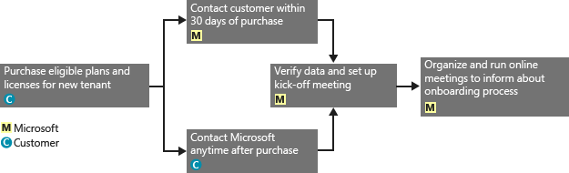
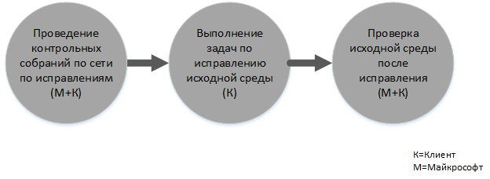

# Процесс предоставления преимущества FastTrack Center для Intune
Если ваша организация имеет право на преимущество службы Microsoft Intune, вы можете привлечь удаленных специалистов корпорации Майкрософт для подготовки вашей среды Microsoft Intune к работе.

Microsoft Intune — часть пакета Microsoft Enterprise Mobility Suite (EMS), который предоставляет возможности Enterprise Mobility Management (EMM), включая управление мобильными устройствами (MDM) и управление мобильными приложениями (MAM).  Microsoft Intune можно использовать, чтобы предоставить пользователям возможность работать на мобильных устройствах, подготавливая устройства, настраивая их и развертывая мобильные приложения.  Кроме того, Microsoft Intune можно использовать для защиты корпоративных данных за счет мониторинга соответствия устройств, защиты мобильных приложений и данных и интеграции с Azure AD для управления доступом к корпоративным службам.

Чтобы узнать, обладает ли ваша организация соответствующими правами, см. [Предоставление преимущества FastTrack Center для Intune](../Topic/FastTrack_Center_Benefit_for_Intune.md). Если вы заинтересованы в подготовке среды для других служб Enterprise Mobility Suite, см. раздел [Преимущество FastTrack Center для Enterprise Mobility Suite](../Topic/FastTrack_Center_Benefit_for_Enterprise_Mobility_Suite.md).

**Необходимы сведения о Microsoft FastTrack для Office 365? См. раздел** [Преимущество FastTrack Center для Office 365](https://technet.microsoft.com/library/office-365-onboarding-benefit.aspx).

В этой статье содержатся следующие сведения о преимуществе службы для Microsoft Intune.

-   [Overview of the onboarding process](#overview_onboarding_process)

-   [Expectations for your source environment](#expectations_src_environ)

-   [Phases of the onboarding process](#phases_onboarding_process)

-   [Microsoft responsibilities](#microsoft_responsibilities) для каждого этапа

-   [Your responsibilities](#your_responsibilities) для каждого этапа

Адаптация дает следующие результаты:

-   Создается клиент Microsoft Online Service.

-   Лицензированные пользователи могут получить доступ к службе Microsoft Intune с помощью одного из следующих вариантов удостоверений:

    -   Облачные удостоверения (уникальные учетные записи Microsoft Online Service).

    -   Синхронизированные удостоверения: учетные записи Microsoft Intune синхронизированы из локальной службы Active Directory с Azure Active Directory Connect (службы синхронизации).

        -   Для клиентов со средой Active Directory с одним лесом.

        -   Для клиентов, которые используют топологию Active Directory с несколькими лесами.

-   Федеративные удостоверения — учетные записи Microsoft Intune:

    -   синхронизированные из Active Directory с помощью средства Azure Active Directory Connect для клиентов с конфигурацией Active Directory с одним лесом, а также для клиентов с одной учетной записью леса Active Directory (также называемой "лес входа в систему") и одной конфигурацией ресурсов леса Active Directory;

    -   сделанные федеративными с ролью служб федерации Active Directory Windows Server 2012 R2 или сделанные федеративными со службами федерации Active Directory (AD FS) 2.0 или более поздней версии из локальной службы Active Directory.

## Обзор процесса адаптации
Адаптация состоит из двух основных компонентов:

-   **Основные возможности** — задачи, необходимые для настройки конфигурации клиента и интеграции с Azure AD, если это необходимо. Основные возможности также предоставляют базовые показатели для адаптации других соответствующих служб.

-   **Адаптация службы** — задачи, необходимые для настройки Microsoft Intune.

На следующей схеме представлена последовательность событий для использования преимущества FastTrack Center.

Базовый процесс выглядит следующим образом:

-   FastTrack Center свяжется с вами в течение 30 дней после приобретения соответствующего плана. Можно также запросить помощь на сайте [FastTrack Center](http://fasttrack.microsoft.com/), если вы готовы к развертыванию этих служб для вашей организации. Чтобы запросить помощь, войдите на сайт [FastTrack Center](http://fasttrack.microsoft.com/), перейдите на панель мониторинга, выберите имя своей компании, откройте вкладку «Предложения» и нажмите кнопку «Запросить помощь», чтобы запросить помощь для Microsoft Intune, Azure Active Directory Premium или Azure Rights Management Premium.

-   Команда FastTrack Center поможет вам с основными возможностями, а затем окажет однократную помощь с адаптацией каждой соответствующей службы.

Вся поддержка по адаптации будет предоставляться удаленно назначенными специалистами корпорации Майкрософт:

-   Корпорация Майкрософт поможет вам с проведением различных работ по адаптации, предоставляя средства, документацию и рекомендации.

-   Поддержка адаптации обеспечивается центром FastTrack и доступна в обычное рабочее время для данной области.

-   Поддержка адаптации доступна на традиционном китайском, английском, французском, немецком, итальянском, японском, португальском (Бразилия) или испанском языке.

-   Команда Майкрософт может работать непосредственно с вами либо с вашим представителем.

## Ожиданий для исходной среды
Возможно в вашей исходной среде уже имеются службы, на которые вы хотите перейти переместить или которые вы хотите интегрировать со службой Microsoft Intune. Для некоторых служб преимущество FastTrack Center для Intune включает в себя помощь в обеспечении определенного уровня интеграции с исходной средой. Если необходима интеграция, ваша исходная среда должна иметь определенный минимальный уровень для такого применения.

В следующей таблице показаны ожидания для исходной среды при адаптации.

|Действие|Ожидание для исходной среды|
|------------|-------------------------------|
|Основные возможности|Леса Active Directory, для которых в качестве функционального уровня леса установлен Windows Server 2008 или более поздней версии, со следующей конфигурацией:  -   Один лес Active Directory -   Несколько лесов Active Directory **Note:** Для всех конфигураций с несколькими лесами развертывание AD FS не входит в область действия преимущества FastTrack Center.|
|Адаптация служб  -   Microsoft Intune -   Служба Microsoft Intune, интегрированная с System Center Configuration Manager|Для управления устройствами с помощью System Center Configuration Manager 2012 R2 или более поздней версии, подключенной к Microsoft Intune, ИТ-администраторы должны следовать [контрольному списку администратора: настройка Configuration Manager для управления мобильными устройствами с помощью Microsoft Intune](https://technet.microsoft.com/library/jj943763.aspx). **Note:** Преимущество службы не включает в себя помощь по настройке или обновлению System Center Configuration Manager для удовлетворения минимальных требований, необходимых для интеграции Microsoft Intune с System Center Configuration Manager.|

## Этапы процесса адаптации
Процесс адаптации состоит из четырех основных этапов:

-   Инициировать

-   Оценка

-   Исправление

-   Разрешить

Подробное описание задач для каждого этапа см. в разделах [Microsoft responsibilities](#microsoft_responsibilities) и [Your responsibilities](#your_responsibilities).

### Начальный этап
После приобретения соответствующего количества лицензий подходящего типа следуйте указаниям из сообщения электронной почты с подтверждением покупки, чтобы связать эти лицензии с существующим или новым клиентом. FastTrack Center проверит наличие у вас прав на использование преимущества службы. Майкрософт свяжется с вами в течение 30 дней после приобретения соответствующего плана. Можно также запросить помощь на сайте [FastTrack Center](http://fasttrack.microsoft.com/), если вы готовы к развертыванию этих служб для вашей организации. Чтобы запросить помощь, войдите на сайт [FastTrack Center](http://fasttrack.microsoft.com/), перейдите на панель мониторинга, выберите имя своей компании, откройте вкладку «Предложения» и нажмите кнопку «Запросить помощь», чтобы запросить помощь для Microsoft Intune, Azure Active Directory Premium или Azure Rights Management Premium.

На этом этапе мы обсудим весь процесс адаптации, проведем проверку данных и назначим организационную встречу.

### Этап оценки
После начала процесса адаптации корпорация Майкрософт будет сотрудничать с вами для проведения оценки исходной среды и требований. Для оценки вашей среды будут применяться специальные средства, и корпорация Майкрософт даст вам рекомендации по оценке интернет-браузеров, клиентских операционных систем, DNS, сети, инфраструктуры и системы удостоверений, позволяющей определить потребность в каких-либо изменениях перед адаптацией. На основе текущего состояния мы предоставим план исправления, позволяющий обеспечить выполнение минимальных требований для успешного освоения Microsoft Intune. Мы также настроить установим определенные контрольные точки на этапе исправления.

### Этап исправления
При необходимости вы выполните задачи из плана исправления для своей исходной среды, чтобы она удовлетворяла требованиям по адаптации каждой службы.

Перед началом этапа реализации мы совместно проверьте результаты исправлений, чтобы убедиться, что все готово к дальнейшей работе.

### Этап реализации
После выполнения всех исправлений начинается настройка базовой инфраструктуры для использования службы и подготовка Microsoft Intune.

**Этап реализации: основные возможности**

Реализация основных возможностей включает в себя подготовку служб и интеграцию клиента и удостоверений. Она также включает меры по формированию платформы для адаптации Microsoft Intune.

После реализации основных возможностей можно приступать к адаптации для Microsoft Intune.

**Этап реализации — Microsoft Intune**

Мы поможем вам подготовиться к использованию Microsoft Intune для управления устройствами в зависимости от ваших потребностей в области управления мобильными устройствами и приложениями. Конкретные меры зависят от исходной среды и могут включать в себя следующее:

-   Лицензирование конечных пользователей. При необходимости мы поможем активировать корпоративные лицензии для вашего клиента облачной службы Майкрософт.

-   Настройка удостоверений для использования с Microsoft Intune с помощью либо вашей локальной Active Directory, либо облачных удостоверений.

-   Добавление пользователей в вашу подписку Microsoft Intune, определение ролей ИТ-администратора и создание групп пользователей и устройств.

-   Настройка вашего центра управления мобильными устройствами в зависимости от потребностей управления

    -   Установите Microsoft Intune как ваш центр управления мобильными устройствами, если Microsoft Intune является вашим единственным решением MDM или работает в сочетании с управлением мобильными устройствами для Office 365.

    -   Если у вас уже есть реализация System Center Configuration Manager и вы хотите расширить его возможности управления с помощью Microsoft Intune, установите Configuration Manager в качестве центра MDM.

        > [!NOTE]
        > Если вам нужно только использовать управление мобильными приложениями в отношении устройств конечных пользователей, общих устройств или устройств для киосков, настройка центра управления мобильными устройствами не требуется.

-   Если управление мобильными устройствами входит в вашу область интересов, мы предоставим руководство по следующим вопросам.

    -   Настройка тестовых групп для проверки политик управления MDM.

    -   Настройка политик и служб управления MDM, в том числе следующее.

        -   Развертывание приложений для каждой поддерживаемой платформы с помощью веб-ссылок или прямых ссылок.

        -   Политики условного доступа.

        -   Развертывание профилей электронной почты.

        -   Настройка соединителя Microsoft Intune с Exchange, если это необходимо.

    -   Регистрация до двух тестовых устройств каждой [поддерживаемой платформы](https://technet.microsoft.com/library/dn600287.aspx) в Microsoft Intune или Configuration Manager с помощью службы Microsoft Intune.

    -   Использование отчетов инвентаризации программного обеспечения и оборудования.

-   Если вас интересует управление мобильными приложениями (MAM) или если вы хотите дополнить существующие решения MDM от Майкрософт или сторонних поставщиков политиками MAM, мы предоставим руководство по следующим вопросам.

    -   Настройка политик MAM для каждой поддерживаемой платформы.

    -   Настройка политик условного доступа для управляемых приложений.

    -   Выбор соответствующих групп пользователей с помощью указанных выше политик MAM.

    -   Применение отчетов об использовании управляемых приложений.

-   Если управление компьютерами входит в вашу область интересов, мы предоставим руководство по следующим вопросам.

    -   При необходимости — установка клиентского программного обеспечения Intune.

    -   Использование отчетов по программному обеспечению и оборудованию, доступных в Intune.

## Обязанности корпорации Майкрософт
В этом разделе описываются некоторые обязанности корпорации Майкрософт относительно процесса адаптации.

### Общие

-   Предоставлять вам удаленную поддержку при настройке конфигурации в соответствии с подробным описанием этапов.

-   Предоставлять доступные средства, документацию и программное обеспечение, консоли администрирования и скрипты, помогающие упростить или исключить задачи по настройке.

### Начальный этап

-   Связаться с вами в течение 30 дней после приобретения соответствующих лицензий для нового клиента.

-   Совместно работать для начала процесса адаптации.

-   Определить, какие соответствующие службы вы хотите освоить.

### Этап оценки

-   Предоставить административную сводку.

-   Предоставить рекомендации по следующим аспектам:

    -   Потребности для DNS, сети и инфраструктуры.

    -   Потребности клиента (веб-браузер, клиентская операционная система и потребности служб).

    -   Удостоверение пользователя и подготовка к работе.

    -   Включение соответствующих служб, которые были приобретены и определены как часть адаптации.

-   Составить график для исправлений.

-   Предоставить контрольный список коррекции.

### Этап исправления

-   Провести конференцию с вами по согласованному расписанию, чтобы проанализировать ход выполнения операций исправления.

-   Оказать помощь с запуском средств для определения и устранения проблем и с обработкой результатов.

### Этап реализации
Предоставить рекомендации по следующим аспектам:

-   Активация клиента Microsoft Online Service.

-   Настройка протоколов TCP/IP и портов брандмауэра.

-   Настройка DNS для соответствующих служб.

-   Проверка подключения к Microsoft Online Services.

-   Для среды с одним лесом:

    -   Установка сервера синхронизации каталогов между доменными службами служб Active Directory (AD DS) и соответствующими службами Microsoft Online Services, если это необходимо.

    -   Настройка синхронизации паролей (хэш пароля) в Microsoft Intune (Azure Active Directory) с помощью средства Azure Active Directory Connect.

        > [!NOTE]
        > Разработка и внедрение расширений настраиваемых правил находятся вне области действия.

-   Для одного леса, когда целью являются федеративные удостоверения: Установка и настройка служб федерации Active Directory (AD FS) для проверки подлинности локального домена с помощью Microsoft Intune с отказоустойчивой и односайтовой конфигурацией, если это необходимо.

    > [!NOTE]
    > Для всех конфигураций с несколькими лесами развертывание служб федерации Active Directory не входит в область действия преимущества адаптации.

-   Проверка функциональности единого входа (SSO), если она развернута.

#### Этап реализации — Microsoft Intune
Предоставить рекомендации по следующим аспектам.

-   Лицензирование конечных пользователей. При необходимости мы поможем активировать корпоративные лицензии для вашего клиента облачной службы Майкрософт.

-   Настройка удостоверений для использования с Microsoft Intune с помощью либо вашей локальной Active Directory, либо облачных удостоверений.

-   Добавление пользователей в вашей подписке Microsoft Intune, определение ролей ИТ-администратора и создание групп пользователей и устройств.

-   Настройка вашего центра управления мобильными устройствами в зависимости от потребностей управления

    -   Установите Microsoft Intune как ваш центр управления мобильными устройствами, если Microsoft Intune является вашим единственным решением MDM или работает в сочетании с управлением мобильными устройствами для Office 365.

    -   Если у вас уже есть реализация System Center Configuration Manager и вы хотите расширить его возможности управления с помощью Microsoft Intune, установите Configuration Manager в качестве центра MDM.

        > [!NOTE]
        > Если вам нужно только использовать управление мобильными приложениями в отношении устройств конечных пользователей, общих устройств или устройств для киосков, настройка центра управления мобильными устройствами не требуется.

-   Если управление мобильными устройствами входит в вашу область интересов, мы предоставим руководство по следующим вопросам.

    -   Настройка тестовых групп для проверки политик управления MDM.

    -   Настройка политик и служб управления MDM, в том числе следующее.

        -   Развертывание приложений для каждой поддерживаемой платформы с помощью веб-ссылок или прямых ссылок.

        -   Политики условного доступа.

        -   Развертывание профилей электронной почты.

        -   Настройка соединителя Microsoft Intune с Exchange, если это необходимо.

    -   Регистрация до двух тестовых устройств каждой поддерживаемой платформы в Microsoft Intune или Configuration Manager с помощью службы Microsoft Intune.

    -   Использование отчетов по инвентаризации программного обеспечения и оборудования.

-   Если вас интересует управление мобильными приложениями (MAM) или если вы хотите дополнить существующие решения MDM от сторонних поставщиков политиками MAM, мы предоставим руководство по следующим вопросам.

    -   Настройка политик MAM для каждой поддерживаемой платформы.

    -   Настройка политик условного доступа для управляемых приложений.

    -   Выбор соответствующих групп пользователей с помощью указанных выше политик MAM.

    -   Применение отчетов об использовании управляемых приложений.

-   Если управление компьютерами входит в вашу область интересов, мы предоставим руководство по следующим вопросам.

    -   При необходимости — установка клиентского программного обеспечения Intune.

    -   Использование отчетов по программному обеспечению и оборудованию, доступных в Intune.

## Ваши обязанности
В этом разделе описываются некоторые ваши обязанности относительно процесса адаптации.

### Общие

-   Любые улучшения и интеграции для вашего клиента Microsoft Online Service, выходящие за рамки описанных в этой статье вариантов настройки.

-   Общее управление программой и проектом по использованию ресурсов.

-   Взаимодействие с конечными пользователями, ведение необходимо им документации, их обучение и управление изменениями.

-   Ведение документации для службы технической поддержки и обучение ее сотрудников.

-   Создание отчетов, презентаций или протоколов собраний, относящихся к вашей организации.

-   Создание документации по архитектуре и технической документации для вашей организации.

-   Проектирование, приобретение, установка и настройка оборудования и сетевых компонентов.

-   Приобретение, установка и настройка программного обеспечения.

-   Настройка, упаковка и распространения необходимого клиентского программного обеспечения для Microsoft Intune.

-   Активация мобильных устройств.

-   Настройка конфигурации, анализ, проверка пропускной способности, тестирование и мониторинг сети.

-   Управление процессом утверждения для управления техническими изменениями и создание вспомогательной документации.

-   Указание и определение групповых политик для управления пользователями, рабочими станциями и серверами.

-   Изменение рабочей модели и руководств по эксплуатации.

-   Настройка многофакторной проверки подлинности.

-   Списание и удаление исходных сред (например, других решений для управления компьютерами или устройствами).

-   Создание и обслуживание тестовой среды.

-   Установка пакетов обновления и других необходимых обновлений на серверах инфраструктуры.

-   Предоставление и настройка любых общедоступных SSL-сертификатов.

-   Составление заявления об условиях использования, которое будет адаптировано и отображено на корпоративных порталах Microsoft Intune, доступных конечным пользователям.

### Начальный этап

-   Работа с командой Майкрософт для начала адаптации соответствующих служб.

-   Принять участие в организационной встрече, контролировать и направлять участников со стороны вашей компании, а также подтвердить сроки исправления.

### Этап оценки

-   Определить соответствующих заинтересованных лиц (включая руководителя проекта) для выполнения необходимых действий по оценке.

-   При необходимости предоставить специалистам корпорации Майкрософт общий доступ к экрану, когда требуется получить рекомендации при запуске средств оценки для среды или подписки Microsoft Intune.

-   Участвовать в собраниях для составления контрольного списка исправления и разработки всего плана, включая различные аспекты, связанные с инфраструктурой, сетью, администрированием, подготовкой к синхронизации каталогов, сетевой безопасностью и федеративными удостоверениями.

-   Участвовать в собраниях для выработки подхода к подготовке пользователей.

-   Участвовать в собраниях для планирования конфигурации веб-служб.

-   Создать план поддержки для подготовки к переходу.

### Этап исправления

-   Принять необходимые меры для выполнения исправлений, определенных на этапе оценки.

-   Участвовать в собраниях, где рассматриваются контрольные точки.

### Этап реализации

-   При необходимости предоставить специалистам корпорации Майкрософт общий доступ к экрану, когда требуется получить рекомендации при внесении изменений в среду или подписку Microsoft Intune.

-   Обеспечить должное управление ресурсами.

-   Настраивать сетевые элементы согласно рекомендациям корпорации Майкрософт.

-   Осуществлять подготовку каталогов и настройку синхронизации каталогов согласно рекомендациям корпорации Майкрософт.

-   Настраивать инфраструктуру безопасности (например, порты брандмауэра) согласно рекомендациям корпорации Майкрософт.

-   Внедрить подходящую клиентскую инфраструктуру.

-   Реализовать подход к подготовке пользователей согласно рекомендациям корпорации Майкрософт.

-   Обеспечить наличие различных служб согласно рекомендациям корпорации Майкрософт.

-   Сотрудничать с корпорацией Майкрософт для завершения адаптации всех соответствующих служб в течение 12 месяцев с момента начала адаптации.

-   Если вы начинаете управлять компьютерами или мобильными устройствами с помощью Microsoft Intune, при включении политик управления через Microsoft Intune используйте тестовые устройства. Если тестовые устройства недоступны, клиенты отвечают за резервное копирование и — при необходимости — восстановление всего содержимого устройств, используемых на этапе реализации Microsoft Intune.

-   Выбор до двух приложений для каждой поддерживаемой платформы Microsoft Intune, которые можно развернуть с помощью веб-ссылок или прямых ссылок.

-   Контроль, настройка и применение политик безопасности, помимо тех, которые используются для тестирования базовой конфигурации и функциональных возможностей служб Microsoft Intune.

## Хотите узнать больше?
См. разделы [Microsoft Intune](http://www.microsoft.com/en-us/server-cloud/products/microsoft-intune/default.aspx) и [Enterprise Mobility Suite](http://www.microsoft.com/en-us/server-cloud/products/enterprise-mobility-suite/default.aspx).

